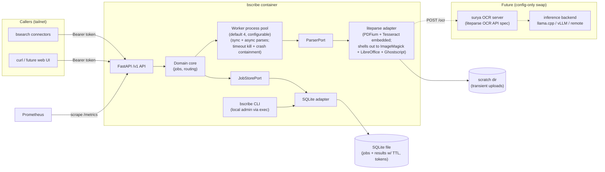

# bscribe — Design

| | |
|---|---|
| Author | Ben Crisp (ben@thecrisp.io) |
| Status | Draft |
| Created | 2026-07-05 |
| Updated | 2026-07-07 |

## Objective

bscribe is a self-hosted HTTP service that converts documents (PDFs, office documents, images) into plain text or markdown, for consumption by other self-hosted services.

## Background

I've re-implemented PDF-to-text extraction as hastily written scripts across several projects. Each new project that touches PDFs repeats the work — often badly.

There's no system waiting on bscribe today, but a planned personal semantic search service ("bsearch") will need document text on its ingest path to compute embeddings. bsearch will likely have multiple ingestion connectors pulling documents from different places; all of them need the same PDF processing. bscribe keeps that capability in one service instead of re-implementing it per connector.

There's also a privacy motivation: online converter sites are the easy alternative for ad-hoc conversions, but uploading PDFs containing personal details to unknown third parties is unacceptable. A private service does the job without the exposure, and a simple web UI could later make it the default tool for one-off conversions.

## Goals

- Stop re-implementing document extraction; every future project calls one API.
- Convert documents without any content leaving machines I control.
- Get usable text from challenging documents (poor-quality scans, complex layouts) — not just clean born-digital PDFs.
- Keep the API stable enough that dependent services (bsearch connectors) don't break when bscribe internals change.

## Non-goals

- **No user accounts.** Single human user. No accounts, no tenants, no per-user quotas, no token-management API — tokens are managed by a local admin CLI (host exec), never over HTTP. Auth is a small set of long-lived bearer tokens, one per caller, each independently revocable. Tokens are principals — each sees only its own jobs (see Security) — but that is caller isolation, not user identity: no profiles, no roles, no admin scopes.
- **No document storage.** bscribe is not a document store or DMS. Documents transit the service; results are retained briefly for async pickup only. Downstream services own their own storage.
- **No semantic layer.** No embeddings, chunking, summarization, or entity extraction. Text/markdown out; downstream services own meaning.
- **No hosted or commercial offering.** Open source on GitHub, but no hosted option and no commercial ambitions. Others self-host at their own risk.

## Missing features (v1)

Deliberately excluded from v1 but wanted eventually:

- **VLM-based OCR** (surya-ocr-2-class models) for hard documents. Deferred: too many unknowns around model inference today. Consequence: v1 quality ceiling on poor scans is traditional OCR (Tesseract-class). Integration path is already settled — see "Future work: VLM OCR" below.
- **Web UI** for ad-hoc conversions. Consequence: v1 is usable only via curl/API clients.

## Constraints

- **Modest hardware.** Must run comfortably on Raspberry Pi 5-class hardware (ARM64, ~8GB RAM shared with other services) and small cloud VPSs. Rules out memory-hungry runtimes and local model inference.
- **No GPU.** Model inference, when it comes, will be a separate inference service (cloud or self-hosted — undecided) reached over the network. bscribe itself never assumes a GPU.
- **Container-first.** Deployed as a podman/docker container on Linux, like all my self-hosted services. Multi-arch images required (arm64 + amd64).

## Architecture & technology choices

| Concern | Choice | Why | Swap cost |
|---|---|---|---|
| Language/runtime | Python 3.14 + FastAPI | Language I know well; liteparse has first-class Python bindings; FastAPI mature, async-native, free OpenAPI docs. 3.14 = latest stable (July 2026) | Rewrite — but service is small by design |
| ASGI server | uvicorn | Standard, boring; parsing dominates cost, not the HTTP layer — granian's throughput edge buys nothing at single-user scale | One-line entrypoint change; granian/hypercorn are drop-in ASGI |
| Internal structure | Hexagonal (ports & adapters): domain core + `ParserPort`, `JobStorePort` as `Protocol` classes; liteparse and SQLite are adapters | Makes the swap costs in this table real; matches my existing Protocol/DI Python style | n/a — this IS the swap mechanism |
| Parsing engine | liteparse (Python bindings) | Rust core fast on modest hardware; markdown/text output; complexity detection; pluggable OCR | Adapter behind `ParserPort`; replaceable (docling, pypdfium) without touching domain or API |
| OCR (v1) | liteparse built-in Tesseract | Good enough for clean scans. Not truly bundled: the Tesseract binding downloads its `eng.traineddata` at first OCR (see Closed issues) — the container bakes it at build time so runtime OCR is offline and needs no extra infra | Config change — see next row |
| OCR (later) | Any HTTP server implementing the liteparse OCR API spec (surya-ocr-2 server) | The spec is the stable boundary: image in, text+bboxes out. bscribe code unchanged when VLM arrives | Config (endpoint URL). The OCR/inference service itself is a separate deployment |
| Job + token state | SQLite (single file in data volume, WAL mode — server plus occasional local-CLI writer) | Single user, handful of concurrent jobs; survives restart; no extra container | Schema ports to Postgres if ever outgrown |
| Admin CLI | `bscribe` entrypoint built with typer (`serve`, `healthcheck`, `token add/list/delete`) | Same ecosystem as FastAPI (click-based, typed), free `--help`; keeps token management off the network | Trivial — thin layer over domain calls |
| Job execution | Warm **process pool** (default 4 recycled workers, configurable; pebble-style: per-job timeout SIGKILL, per-job crash containment, recycle-after-N-jobs) inside the container. FastAPI parent owns HTTP and all job state; workers only parse — file path in, text out over a pipe, no SQLite access. All parsing — sync and async paths alike — runs on this pool; nothing CPU-bound ever runs on the event loop | A hung or segfaulting native parse (untrusted bytes in PDFium/Tesseract/LibreOffice) kills one disposable worker, not the service, and enables real cancellation of running jobs; recycling bounds native-lib leaks. Threads were the original choice — see Closed issues for the reversal. Cost: ~200–400MB extra RSS for 4 warm workers (forkserver + preload shares some), one dep; dispatch overhead ~ms, so the ~10ms/page sync path survives | No queue infra for one user's load; one bound (4) governs total parse concurrency regardless of endpoint. Splitting workers onto other machines still requires a real queue (Redis/arq) — accepted risk |
| Uploads/results | Uploads to a scratch dir on disk, deleted after processing; results (text/markdown — small) stored in the SQLite job row, TTL-purged | Documents transit, per non-goal | Low |
| Packaging | Multi-arch container (arm64 + amd64), single image, built on native runners (arm64 on GitHub's `ubuntu-24.04-arm`, not QEMU — the LibreOffice apt layer is pathological under emulation); includes ImageMagick (image→PDF), LibreOffice (office→PDF), librsvg (`rsvg-convert` = ImageMagick's SVG decode delegate on Debian, and the *safe* SVG renderer — see Security), and Ghostscript (liteparse gates SVG/EPS/PS inputs on a `gs` binary being present, though the actual SVG render goes through librsvg here). LibreOffice + the baked OCR data push the image to ~1.1GB; accepted, disk is cheap and a slim/full variant matrix isn't | Matches podman/docker homelab standard | Low |
| Office document support | liteparse's built-in LibreOffice conversion (`soffice --headless --convert-to pdf`, fresh temp `UserInstallation` profile per conversion — concurrency-safe, 120s timeout) | Zero bscribe code; verified in liteparse `conversion.rs`. Accepted formats include doc/docx, xls/xlsx/csv, ppt/pptx, odt/ods/odp, rtf, pages/numbers/key | Drop LibreOffice from the image, formats 422 |

### Future work: VLM OCR

surya-ocr-2 (650M-parameter VLM) emits bbox-level blocks — text, polygons, layout labels, reading order — which fits liteparse's OCR HTTP API spec directly. The liteparse repo ships a reference surya OCR server (`ocr/suryaocr/`) implementing the spec. That server internally decouples the OCR protocol from inference:

```
bscribe/liteparse ──POST /ocr (liteparse OCR spec)──> surya OCR server (container)
                                                          │ SURYA_INFERENCE_BACKEND
                                                          ├─ llama.cpp  (CPU, ~0.1 pages/s)
                                                          ├─ vLLM      (GPU box, ~5 pages/s on RTX 5090)
                                                          └─ remote OpenAI-compatible URL (SURYA_INFERENCE_URL)
```

Consequences:

- bscribe's change when VLM OCR arrives is one config value (the OCR endpoint URL). Zero code.
- CPU inference (~0.1 pages/s) is viable for async jobs without a GPU — fully self-hosted VLM OCR, just slow. GPU or cloud only buys speed.
- The privacy goal survives: the whole chain can stay on machines I control.
- Escape hatch: if some future model emits page-level markdown without bboxes (olmOCR-style), it won't fit the OCR spec and would instead become a second parser adapter behind `ParserPort`. surya-ocr-2 does not need this.

## System diagram



PDFium and Tesseract appear by name because they are part of the untrusted-input attack surface (see Security); they arrive embedded in liteparse's Python wheel, never used directly (Tesseract's language data is the one exception — baked into the image at build, see Closed issues). The other members — ImageMagick (image→PDF), LibreOffice (office→PDF), librsvg (SVG rendering), and Ghostscript — are installed in the container as system packages.

## Interfaces

### Endpoints

| Method/path | Purpose |
|---|---|
| `POST /v1/convert` | Synchronous conversion. Multipart upload; result inline in response. Runs on the same worker pool as async jobs — a sync request waits for a free slot, so total parse concurrency is bounded at 4 even during a connector backfill. No page limit; uploads bounded only by the global max size. Long conversions run against the per-job timeout (default 10 min → `500`) and any proxy timeouts — OCR-heavy or huge documents belong on the async path. |
| `POST /v1/jobs` | Asynchronous conversion. Same parameters as `/v1/convert`; returns `201` immediately with the job object (id, status, submission parameters, timestamps). |
| `GET /v1/jobs` | List the calling token's jobs, newest first; `?status=` filter. Returns a wrapper object (`{"jobs": […]}`), not a bare array, so pagination/metadata can be added later without `/v2`. |
| `GET /v1/jobs/{id}` | Job status: `queued` \| `running` \| `done` \| `failed`, as the same job object every job endpoint uses; `failure_detail` carries a fixed reason string on failed jobs (see lifecycle details). |
| `GET /v1/jobs/{id}/result` | Result when done (`200`, same document shape as the sync response); `202` while `queued`/`running` (body is the job object, carrying current status); `409` for a terminal job with no result (`failed`) — the failure reason is read from the status endpoint, never composed into the `409`. |
| `DELETE /v1/jobs/{id}` | Cancel and purge a job in any state; `204` on success (`404` per the status-code table for unknown or other-token jobs). For `running` jobs the worker process is killed — real cancellation, a direct benefit of the process-pool execution model. |
| `GET /v1/info` | Service/pipeline identity: current versions of **every** pipeline component (bscribe, liteparse, PDFium, Tesseract/OCR model, ImageMagick, LibreOffice) and the current `pipeline_fingerprint`. Lets callers check "has the pipeline changed?" without submitting a document. |
| `GET /healthz` | Liveness (no auth). |
| `GET /metrics` | Prometheus metrics (no auth, tailnet-internal). |

The API is path-versioned (`/v1`). Breaking changes require `/v2`; additive changes (new optional params, new response fields) do not bump the version. This is the stability contract bsearch connectors rely on.

Request parameters (both conversion endpoints): `file` (multipart, required), `output` = `markdown` (default) | `text`, `ocr` = `auto` (default, via liteparse complexity detection) | `off`. (A `force` mode was dropped from v1 — see Closed issues; adding it back later is additive.)

Accepted inputs: PDFs, images (jpg/png/gif/bmp/tiff/webp/svg, via ImageMagick), and office documents (Word/Excel/PowerPoint families incl. OpenDocument, RTF, CSV, Apple iWork — via LibreOffice). Unsupported formats get a `415`; supported formats that fail to parse get a `422` (sync) or a `failed` job (async).

A configurable global max upload size (default 50MB, rejected with `413`) guards disk and doubles as the only memory guard on the office-conversion path (LibreOffice can spike hundreds of MB on large inputs — see SLOs). Deployments that genuinely need bigger documents raise it deliberately.

Job lifecycle details:

- **Status precision.** `running` means "dispatched to the worker pool", stamped when the job's background task starts awaiting the pool — which happens almost immediately after submission. Beyond `worker_count` concurrent jobs, a job therefore reports `running` while still queued inside the pool (pebble exposes no started-hook); `queued` is in practice a near-instantaneous state meaning "not yet handed to the pool". Accepted imprecision at single-user scale.
- **Failure details.** `failure_detail` values come from a fixed vocabulary — `"document could not be parsed"`, `"timeout"`, `"worker crashed"`, `"internal error"`, plus the startup sweep's `"interrupted by restart — resubmit"` (M2.4) — defined in one module as the single audit site. Parser exception text is never stored or surfaced: liteparse's `ParseError` may quote document content (see Privacy).
- **Job timeout.** Configurable per-job deadline (default 10 min). At the deadline the worker process is SIGKILLed and the job marked `failed` with detail `"timeout"`; a sync request hitting the deadline gets a `500` problem response. No pool slot is ever permanently lost — the pool respawns the worker.
- **Startup sweep.** Worker processes live and die with the container, so a restart abandons `running` jobs. On boot, any job found in `running` is marked `failed` with detail `"interrupted by restart — resubmit"`, and the scratch dir is wiped — a restart mid-parse orphans uploaded files there. Re-queueing is not possible: the uploaded document lives in the scratch dir and may not survive the restart. Consistent with the data-loss SLO (callers resubmit).
- **Ownership.** Jobs are owned by the bearer token that created them, and every job endpoint is token-scoped: `GET /v1/jobs` lists only the caller's jobs; `GET`/`DELETE` on another token's job returns `404`, indistinguishable from a nonexistent id, so job existence never leaks across tokens. There is no admin or list-all scope — the operator's debug path is querying SQLite directly on the host. The sync endpoint is unaffected (nothing stored to protect).

### Sample exchange

```
POST /v1/convert
Authorization: Bearer <token>
Content-Type: multipart/form-data
  file=@statement.pdf, output=markdown
```

```json
{
  "output": "markdown",
  "content": "# Bank Statement\n\n| Date | Description | Amount |\n|---|---|---|\n| 2026-06-01 | ...",
  "metadata": {
    "pages": 3,
    "duration_ms": 412,
    "pipeline": {
      "fingerprint": "a41f7c2e9b03",
      "components": {
        "bscribe": "1.2.0",
        "liteparse": "2.4.0",
        "pdfium": "138.0"
      }
    }
  }
}
```

Async: `POST /v1/jobs` → `201 {"id": "…", "status": "queued", …}` — the full job object (submission parameters, timestamps, `failure_detail`); poll `GET /v1/jobs/{id}` for the same object; fetch the same result document as the sync response from `/result`.

Errors: RFC 9457 `application/problem+json` (`{"type", "title", "status", "detail"}`).

Status code usage (audited against RFC 9110; the pattern for async polling follows the standard request-reply convention — `202` while in progress):

| Code | Used for |
|---|---|
| `200` | Sync result, job status, ready result |
| `201` | Job created (`POST /v1/jobs`) |
| `202` | Result requested while job still `queued`/`running` |
| `204` | Job deleted |
| `400` | Malformed request (bad params, broken multipart) |
| `401` | Missing/invalid bearer token |
| `404` | Unknown job id, or a job owned by a different token (indistinguishable by design) |
| `409` | Result fetch on a `failed` job |
| `413` | Upload exceeds max size |
| `415` | Unsupported input format |
| `422` | Supported format, document unparseable (sync path) |
| `500` | Worker crash or job timeout on the sync path; other unexpected failures |

### Re-ingestion contract

bscribe stays stateless — it never remembers what it parsed. Each result's `pipeline.components` map lists the components the document **actually traversed**, with versions: a born-digital PDF traverses bscribe + liteparse + PDFium; a scan adds Tesseract; a `.docx` adds LibreOffice; an image adds ImageMagick. The `fingerprint` is a hash over *all* output-affecting component versions and config (including OCR model/language data), whether or not a given document used them.

Callers (bsearch) store the whole `pipeline` block alongside each ingested document. On each ingest cycle:

1. Stored fingerprint == `GET /v1/info` fingerprint → nothing changed anywhere, done.
2. Otherwise, per document, one uniform rule: **re-parse if any component on the document's stored path has a different current version.** OCR bumps never touch born-digital documents, LibreOffice bumps touch only office documents — no special cases per format.

An `ocr_used` quality signal (OCR text may deserve less trust downstream) is deferred — liteparse does not report it and deriving it proved costly (see Closed issues). It would carry no re-ingestion logic; adding it later is additive. Occasional unnecessary re-parses — a traversed component bumped without changing output for that document — are accepted at single-user scale.

### Admin CLI

The container image ships a `bscribe` CLI — one entrypoint for both the server and local administration. Token management is deliberately *not* part of the HTTP API (see Non-goals); the admin path is a local exec (`podman exec bscribe bscribe token …`) talking directly to SQLite, so tampering with tokens requires host access, not just network access.

| Command | Purpose |
|---|---|
| `bscribe serve` | Run the server (container CMD) |
| `bscribe healthcheck` | Probe local `/healthz`, exit 0/1 — used by the container `HEALTHCHECK`, avoids shipping curl |
| `bscribe token add <label>` | Create a token: generates the secret, prints id + secret **once**. Secrets are never user-chosen |
| `bscribe token list` | ids, labels, created timestamps — never secrets |
| `bscribe token delete <id>` | Revoke, effective immediately — the server checks the token table per request, no restart |

Token model: `(id, label, secret_hash, created_at)`. `id` is short, opaque, immutable; jobs stamp `token_id`, so relabeling never orphans jobs. Secrets are generated as 256-bit random values with a `bscribe_` marker prefix (grep-able, secret-scanner friendly; the full string, prefix included, is what gets hashed) and stored as unsalted SHA-256 hashes — sound for random keys, unlike passwords, since there is no dictionary to attack. Lookup hashes the presented bearer token, so a copied database yields no usable credentials. A lost secret is unrecoverable: rotate by `delete` + `add`. A deleted token's jobs become unreachable (there is no admin read path over jobs) and age out via the normal TTL purge.

The CLI writing SQLite while the server runs is the one genuine multi-process access pattern; WAL mode + `busy_timeout` absorb it.

## SLOs

Deliberately loose — one user, retry-friendly callers, zero revenue impact. These numbers exist to kill over-engineering, not to aspire to.

| Metric | Target | Consequence for design |
|---|---|---|
| Availability | Best effort; unavailable for a day = fine. Callers retry | No HA, no replicas, single container, restart-on-failure is the whole story |
| Callers | 1–3 internal services + occasional curl | A handful of long-lived bearer tokens, one per caller; no rate limiting; no quotas |
| Concurrent jobs | 4 (configurable; matches Pi 5 core count) | Worker pool default 4; SQLite uncontended at this scale |
| Sync latency (born-digital only) | p95 < 5s for a clean 10-page born-digital PDF on Pi 5. The 10-page p95 baseline was established 2026-07-05; the hardened v0.1.0 container re-confirms the underlying **9–11 ms/page** rate on the Pi 5 (2026-07-07, single-page fixture) unchanged, so hardening adds no parse overhead and the p95 holds with ~50× headroom. Method and figures in Appendix A | Violation = bug tripwire, not tuning signal; no perf work planned |
| Sync latency (OCR path) | No target. OCR is ~1.1s/page (Tesseract, measured), so a scanned 10-pager takes ~11s synchronously — permitted (well inside the per-job timeout; caller owns HTTP/proxy timeout risk) but the async path is the intended route for scanned documents | Sync stays limit-free; docs/README steer OCR-heavy workloads to `/v1/jobs` |
| Sync latency (office docs) | No target. Each conversion spawns a fresh LibreOffice process. Measured on the Pi 5 (2026-07-07, hardened v0.1.0): **~2.1 s/page** (6.4 s for a 3-page `.doc`, LibreOffice spin-up dominating), and container RSS peaking at **~1.14 GB** under 4 concurrent office conversions from a ~324 MB idle — no OOM under a 2 GB cap. Details in Appendix A | Worker-pool bound (default 4) also caps concurrent soffice processes, protecting the Pi's shared RAM; size the container `--memory` cap above the expected peak |
| Async throughput | No deadline. A job is done when it's done; CPU VLM OCR at ~0.1 pages/s later is acceptable | No queue tuning, no priorities, no job SLAs |
| Data loss | Losing all queued jobs/results = shrug; callers resubmit | Job persistence is convenience, not a durability promise; no backups of bscribe state |

## Security

Exposure: bscribe listens only on the tailnet (`marlin-tet.ts.net`) or LAN behind the existing reverse proxy. It is never exposed to the public internet. TLS is provided by Tailscale or the reverse proxy; bscribe itself serves plain HTTP inside that boundary.

Threat scenarios:

- **Malicious/malformed document.** The realistic attack surface: PDFium, Tesseract, ImageMagick (image→PDF; the worst CVE history of the set), Ghostscript, librsvg (SVG rendering), and LibreOffice (office→PDF; headless conversion does not execute macros, but its parsers are another large C++ codebase) are all fed untrusted bytes. Mitigations: every parse runs in a disposable, recycled worker process — a crash or hang is contained to that one job and the worker is respawned (see Architecture); container runs as non-root with a read-only root filesystem and no added capabilities; memory/CPU limits at the container level; documents come only from authenticated callers (me); worst case is contained to a service whose entire state is disposable (see SLOs — data loss = shrug). SVG is an accepted input and the ImageTragick class of attack (outbound fetches, local file reads via SVG/MVG/MSL) is the specific concern, since container hardening does not stop outbound requests on the tailnet. Two controls address it, delivered in M1.6: (1) SVG rendering goes through **librsvg** (`rsvg-convert`), ImageMagick 6's SVG decode delegate on Debian and a far more conservative renderer than ImageMagick's internal MSVG/MVG path — librsvg 2.54 does not fetch remote resources and restricts local file access to the SVG's own directory (uploads are staged in isolation, so nothing sensitive is co-located). (2) A restrictive `policy.xml` baked into the image replaces Debian's stock policy (which disables PDF/PS — we need PDF write for image→PDF output): it re-enables the formats we need and denies remote-fetch coders, script-like coders, and indirect (`@file`) reads, plus resource limits. Both were verified against adversarial SVGs (remote-fetch and `file://` probes) during M1.6.
- **Leaked bearer token.** Second factor only — an attacker would also need tailnet access. Tokens are provisioned via the local admin CLI (see Interfaces), one per caller (e.g. `bsearch`, `adhoc`), stored in SQLite as SHA-256 hashes; revoking one caller = `token delete <id>`, effective immediately, others unaffected. Tokens are principals: each token can see and delete only the jobs it created, so a leaked token exposes only that caller's transient jobs and results, not everything in the store. A revoked token's jobs sit orphaned until the TTL purge. There is no token-management API — that would creep toward user accounts (see Non-goals). Tokens never appear in logs or error responses; the token *label* may appear in logs to attribute requests.
- **Compromised tailnet device.** Any tailnet device can reach the API with a token. Accepted: bscribe holds no stored documents to exfiltrate; the blast radius is that token's transient job results.
- **SSRF via OCR endpoint.** The OCR server URL is operator-set config, not caller-supplied. No caller-controlled outbound requests exist in the API.

bscribe provides no at-rest encryption. The SQLite file holds job results (extracted document text) and token hashes; protecting the filesystem/volume — disk encryption, host access control — is the operator's responsibility.

Not addressed (deliberately): rate limiting, audit logging, multi-user isolation — see Non-goals.

## Privacy

Documents are the sensitive asset — bank statements, medical letters, IDs. Rules:

- Document content never leaves machines I control. When remote OCR/inference arrives, pointing bscribe at a cloud-hosted OCR endpoint is a per-deployment choice that knowingly relaxes this — the design for that feature must flag it.
- Document content and extracted text are never logged at any level. Filenames only at DEBUG. Job records reference documents by id and size, not name, at INFO.

## Data retention

- **Uploads:** written to a scratch dir for processing, deleted as soon as parsing completes (success or failure).
- **Results + job records:** kept in SQLite for async pickup, purged after a TTL — default 7 days, configurable. `DELETE /v1/jobs/{id}` purges immediately.
- **Backups:** none. bscribe state is explicitly not durable; callers own their data.

## Monitoring & alerting

bscribe joins the existing Prometheus/Grafana stack. `/metrics` exposes:

- HTTP request count + duration histograms, by endpoint and status
- Jobs by state (gauge), job duration histogram (a split by OCR use returns with the deferred `ocr_used` signal — see Closed issues), queue depth
- Worker pool health: counters for timeout kills, worker crashes, cancellations, recycles
- A build/pipeline info metric carrying `pipeline_fingerprint` and component versions — a Grafana panel shows at a glance which pipeline version is live

Instrumentation via `prometheus-client` + FastAPI middleware. Alerting stays in the existing stack: `up == 0` on the scrape target is the only alert worth having, per the availability SLO.

## Logging

`structlog`, JSON to stdout; the container runtime owns capture and rotation. INFO = one line per request and per job state transition (job id, sizes, durations, outcome). DEBUG adds filenames and parser internals. Never logged at any level: document content, extracted text (see Privacy), bearer token values (see Security). Log retention is host policy, not bscribe's concern.

## Milestones

Ordered by ROI: each demoable, value before scaffolding.

**M1 — sync converter.** `POST /v1/convert` (markdown/text out, `ocr=auto|off` via liteparse's built-in Tesseract), all input formats (PDF, images, office docs — container ships ImageMagick + LibreOffice + librsvg + Ghostscript, with OCR language data baked in for offline OCR), bearer token auth backed by the SQLite token table, the `bscribe` CLI (`serve`, `healthcheck`, `token add/list/delete`), `/healthz`, multi-arch container image built on native runners, restrictive ImageMagick `policy.xml` + librsvg SVG rendering (see Security), worker process pool (default 4, configurable) with per-job timeout. No job store yet — SQLite carries only tokens in M1. Demo: convert a real bank-statement scan and a `.docx` from curl on the tailnet. Office-conversion overhead and the LibreOffice memory spike were measured on the Pi 5 under the hardened v0.1.0 image (see SLOs and Appendix A).

**M2 — async jobs.** SQLite job store, all `/v1/jobs` endpoints including list and cancellation of running jobs, TTL purge. Demo: submit a 100-page PDF, poll, fetch the result, watch it purge.

**M3 — contract + observability.** `GET /v1/info`, `pipeline` block (fingerprint + components traversed) in result metadata, `/metrics` + Grafana panel. This milestone makes bscribe safe to build bsearch against. Demo: bump liteparse, watch the fingerprint change.

**M4 — VLM OCR.** Deployment recipe for the surya OCR server (liteparse OCR API spec), config-only swap, backend choice per the inference decision in Open issues. Demo: a garbage scan through Tesseract vs surya, side by side.

Backlog (unordered, from Missing features): web UI, webhooks if polling ever annoys.

## Alternatives considered

- **Keep writing per-project scripts** — the status quo this doc exists to end; extraction logic rots in N places, no async, no OCR story.
- **Hosted parse APIs (LlamaParse, cloud OCR)** — quality is good, but sending personal documents to third parties violates the privacy goal. Rejected on principle, not capability.
- **Docling / unstructured / marker as engine** — heavier Python-native stacks; docling is strong on layout but heavyweight for Pi-class hardware; liteparse's Rust core + pluggable OCR spec + complexity detection fits the constraint set better. Revisit behind `ParserPort` if liteparse stalls.
- **Go + parser sidecar** — preferred-language tie, but no liteparse Go binding forces a second process; the Python bindings are first-class. Closed in favour of Python.
- **granian over uvicorn** — Rust ASGI server with real throughput gains on connection-heavy workloads; irrelevant at single-user scale where parsing dominates. Drop-in swap later if ever needed.

## Closed issues

- **How does VLM OCR integrate?** Resolved: behind liteparse's OCR HTTP API spec — surya-ocr-2 emits bbox-level blocks, and liteparse ships a reference surya server; the inference backend (llama.cpp/vLLM/remote) is that server's internal concern. bscribe changes = config only. A `ParserPort` adapter remains the escape hatch for hypothetical page-level-markdown models without bbox output.
- **Job queue infrastructure?** Resolved: none. SQLite + in-process workers; the SLOs (4 concurrent jobs, best-effort durability) don't justify Redis.
- **How do callers know when to re-ingest?** Resolved: stateless components-traversed contract — each result lists the components (with versions) the document actually went through; callers store the block and re-parse a document if a component on its stored path changed, with the global fingerprint as a cheap short-circuit. Callers own the tracking. An earlier fingerprint-only version of this contract needed an `ocr_used` special case to avoid re-parsing born-digital docs on OCR bumps and silently mishandled ImageMagick/LibreOffice bumps; the per-path rule generalizes it away.
- **Does liteparse actually run on Pi 5 / arm64?** Resolved by testing on the target hardware (2026-07-05, `python:3.14-slim` arm64 container on the Pi 5 via podman): PyPI publishes a proper aarch64 manylinux wheel (liteparse 2.4.0, bundled `libpdfium.so`), born-digital parsing works (~10ms/page), `is_complex` works, bundled Tesseract OCR works with zero setup (~1.1s/page), and image input works once ImageMagick is installed in the container (hard external dependency, clear error without it).
- **Threads or processes for the worker pool?** Resolved: **processes** — reversing an earlier threads decision. Threads were first chosen because liteparse's binding releases the GIL around parse calls (`py.detach()`, verified in `liteparse-python/src/lib.rs`), so thread parallelism is real and plumbing is zero. Reopened on failure-mode analysis: a thread wedged in a pathological native parse cannot be killed (the pool slot is lost until a container restart, with `/healthz` green throughout), and a segfault in PDFium/Tesseract/LibreOffice kills the API plus every in-flight job — and a caller auto-retrying a poison document turns that into a crash loop needing a human. A warm process pool (per-job timeout SIGKILL, per-job crash containment, worker recycling — pebble-style; stdlib pools rejected because `ProcessPoolExecutor` breaks the whole pool on one segfault and `multiprocessing.Pool` can't kill a running task) contains both failures to one disposable worker and makes real cancellation of running jobs possible. Costs accepted: ~200–400MB extra RSS, one dependency, a pickle boundary (results are strings — trivial). Workers never touch SQLite; the parent owns all job state, so no multi-writer concern (the local admin CLI is the only other writer — WAL absorbs it, see Admin CLI).
- **How are tokens provisioned?** Resolved: SQLite table + local admin CLI (`bscribe token add/list/delete` via `podman exec`), replacing an earlier static env/file scheme. The CLI wins on: immediate revocation (the server reads the token table per request — env config required a restart), immutable token ids for job ownership (labels can change without orphaning jobs), and secrets hashed at rest (SHA-256 — a copied DB yields no usable credentials). Cost: SQLite moves forward to M1. A token-management HTTP API stays rejected (see Non-goals); the management plane is host-local by design. bscribe provides no at-rest encryption — protecting the filesystem/volume is the operator's responsibility.
- **`ocr=force` in v1?** Resolved: dropped (2026-07-06, during M1.2). liteparse has no force-OCR — OCR control is a single boolean `ocr_enabled` (verified in the 2.4.0 Python wrapper and the Rust core `config.rs`); `true` already OCRs every page its complexity detection flags, i.e. our `auto`. So v1 exposes `ocr = auto | off`; re-adding `force` if liteparse grows support is an additive, non-breaking change.
- **`ocr_used` in result metadata?** Resolved: deferred (2026-07-06, during M1.2 review). liteparse's `ParseResult` reports no ocr-used flag. Deriving it from an `is_complex()` pre-check was implemented and then reverted: the pre-check is a fully independent second document pass (double native load; for office/image inputs a second LibreOffice/ImageMagick conversion), it adds a pre-parse failure surface that can reject documents `ocr=off` parses fine (it runs PDFium page-object walks the non-OCR parse path never touches), and it skews `duration_ms` for `ocr=auto` only — all for a verdict that means "needed OCR", not "OCR contributed". liteparse's `parse()` computes the per-page verdict internally and discards it, so the right fix is upstream: expose ocr-applied on `ParseResult`, then adding `ocr_used` back to metadata is additive. Until then results carry no OCR signal and the M3 metrics split by OCR use is deferred with it.
- **Office formats in v1 or later?** Resolved: v1. Verified in liteparse `conversion.rs` that office support is zero bscribe code — liteparse detects the extension and shells out to LibreOffice headless, with a fresh temp profile per conversion (concurrency-safe) and a 120s timeout. The costs are an ~400MB–1GB bigger image (accepted over maintaining slim/full variants) and LibreOffice joining the untrusted-input threat list. Originally deferred to backlog; pulled forward because the effort turned out to be a Dockerfile line plus docs.
- **Is liteparse's "bundled" Tesseract actually self-contained?** Resolved: no — discovered and worked around during M1.6. The Tesseract binding (the `tesseract-rs` crate) does not embed its language data; on the first OCR it **downloads `eng.traineddata`** (tessdata_best, ~15MB) from GitHub and caches it under `$HOME/.tesseract-rs/tessdata`. The Pi/arm64 validation below only "worked with zero setup" because that host had network and a writable home. A runtime download is incompatible with three of bscribe's constraints at once: no runtime network dependency for conversion, a read-only root filesystem (nowhere to cache), and the non-root service user (its home is not writable). Fix: the container bakes the exact file at build time — pinned to a tessdata_best commit + SHA-256, placed in the service user's cache, owned and read-only at runtime — so OCR runs fully offline with no write. Cost: ~15MB of image and a build-time fetch from GitHub (fails the build loudly if the pinned artifact ever changes). If a future liteparse embeds its own tessdata, the bake becomes redundant and is dropped. This is why the OCR row's "zero extra infra" holds at *runtime* only.
- **Do status polls pay for stored results?** Resolved: no — during M2.2, from the M2.1 review observation that `get`/`list_for_token` SELECTed every column including `result_content`, so once results existed, every status poll and listing would read a done job's full extracted text and discard it (cost scaling with stored text, not job count). The job model is now a **metadata-only snapshot**: the result blob is written solely by the store's `mark_done` transition and read back solely by `get_result`, the one query that touches the `result_*` columns (with `status = 'done'` in the SQL so a non-done row can never leak a partial result). The former model-level "result iff done" invariant moved to the store boundary with it: `add` accepts only `queued` jobs, so terminal states are reachable only through the guarded transitions and a done row without a result is unrepresentable short of external SQLite edits — which `get_result` fails loudly on. Alternatives rejected: a separate metadata type (two models to keep in sync) and relaxing the invariant (every consumer guessing which flavor of job it holds).
- **Native runners vs QEMU for the arm64 image?** Resolved: native, during M1.6. The release build was a single QEMU job building both arches. Baking LibreOffice makes emulation pathological — its apt post-install work (font caches, mime/icon databases, ldconfig) is emulated arm64 CPU and runs many times slower, pushing the arm64 leg into tens of minutes. Switched to GitHub's native `ubuntu-24.04-arm` hosted runner (free for this public repo): each arch builds on its own native runner and pushes by digest, then a merge job stitches the two digests into one multi-arch manifest (`docker buildx imagetools create`) and attests it. More workflow surface (three jobs vs one) but no emulation and no QEMU flakiness. `docker/github-builder` (Docker's reusable workflow that auto-computes the matrix) was considered and passed over — it would swap our GitHub attestation for its own signing model.

## Open issues

- **Inference hosting for M4:** CPU llama.cpp (~0.1 pages/s, fully private, works today) vs a dedicated GPU box vs a cloud API (privacy relaxation). Decide at M4; blocked on real throughput needs, unknown until bsearch exists.
- **liteparse maturity:** the Python package is at 2.4.0 but the project is young and the API may still move. Mitigated by adapter isolation; watch releases.

## Licensing

MIT. No commercial ambitions, zero-friction sharing; liteparse (Apache-2.0) is compatible as a dependency.

## Appendix A — M1 performance measurements (Pi 5, hardened v0.1.0)

Closes the SLO-table measurements deferred through M1. All figures were taken
on the target hardware running the **published `v0.1.0` container**, under the
full hardened runtime contract from [deployment.md](deployment.md) — not a dev
checkout — on **2026-07-07**.

### Test environment

| | |
|---|---|
| Host | Raspberry Pi 5 Model B Rev 1.1 |
| CPU / RAM | 4× Cortex-A76 (aarch64), 15 GiB |
| OS / kernel | Debian GNU/Linux 13 (trixie), `6.12.75+rpt-rpi-2712 aarch64` |
| Container engine | podman 5.4.2, **rootless**, netavark backend |
| Image | `ghcr.io/bcrisp4/bscribe:0.1.0` (arm64, digest `sha256:caa4a41c40bc573719c8e6a3f54adb34b742e328731128a674d6f307e383de56`) |
| Run flags | `--read-only --tmpfs /tmp --cap-drop=ALL --security-opt=no-new-privileges --memory=2g -v <vol>:/data -p 8000:8000` |

### Pipeline component versions (inside the image)

| Component | Version |
|---|---|
| bscribe | 0.1.0 |
| liteparse | 2.4.0 |
| Python | 3.14.6 |
| Base image | `python:3.14-slim-bookworm` (Debian 12 bookworm) |
| ImageMagick | 6.9.11-60 Q16 |
| Ghostscript | 10.00.0 |
| librsvg (`rsvg-convert`) | 2.54.7 |
| LibreOffice (`soffice`) | 7.4.7.2 |
| Tesseract OCR data | `tessdata_best` `eng.traineddata`, pinned to commit `e12c65a915945e4c28e237a9b52bc4a8f39a0cec` (sha256 `8280aed0782fe27257a68ea10fe7ef324ca0f8d85bd2fd145d1c2b560bcb66ba`), baked at build |
| PDFium, Tesseract engine | bundled in the liteparse 2.4.0 wheel |

Test documents: the born-digital PDF was the repo's
`tests/integration/data/sample.pdf`; the 3-page `.doc` and the scanned receipt
PNG were liteparse `integration_tests_data` fixtures. Latencies are read from
each response's `metadata.duration_ms` / `metadata.pages`.

### Results

| Scenario | Input | Result | Notes |
|---|---|---|---|
| Born-digital latency | born-digital PDF | **9–11 ms/page** (warm) | Holds the p95 < 5s / ~10 ms/page SLO; unchanged from the pre-hardening 2026-07-05 baseline, so container hardening adds no measurable parse overhead. |
| Office conversion | 3-page `.doc` | **6.4 s total ≈ 2.1 s/page** | First-parse cost is dominated by the fresh LibreOffice `soffice` spin-up per conversion; the design steers OCR-heavy/large work to the async path (M2). |
| OCR (scanned image) | receipt PNG | **659 ms**, fully **offline** | Baked `eng.traineddata` — the container ran with no outbound network available and OCR still succeeded, confirming the build-time bake removes the runtime tessdata download. |
| LibreOffice memory spike | 4× concurrent `.doc` | idle **~324 MB → peak ~1141 MB**; **no OOM** under `--memory=2g` | ~200 MB per concurrent `soffice` over baseline. The worker-pool bound (default 4) caps concurrent conversions; size `--memory` above the expected peak — a large spreadsheet can spike higher. |

### Operational confirmations

- The image runs **rootless** under podman with a **read-only root filesystem**,
  all capabilities dropped, and `no-new-privileges`; `/healthz` reports healthy
  and `bscribe healthcheck` (the container `HEALTHCHECK`) passes from inside.
- Born-digital, image/OCR, and office paths all convert end-to-end under that
  hardened, offline runtime — no root, no writable root filesystem, no network.

> Note: `sample.pdf` is a single page, so the born-digital per-page figure is a
> per-page rate rather than a 10-page p95; the 2026-07-05 baseline established
> the 10-page behaviour and this run confirms the per-page rate is unchanged
> under hardening. A `pipeline_fingerprint` / `GET /v1/info` (M3) will let these
> component versions be read from a running instance rather than recorded by hand.
