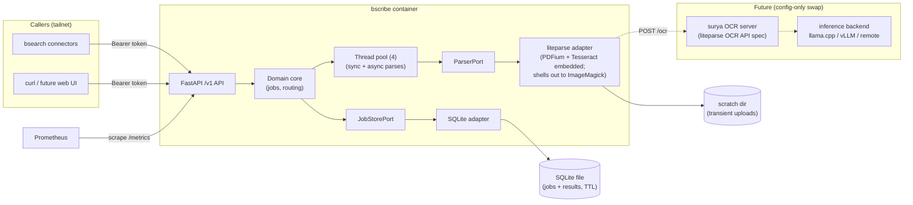

# bscribe — Design

| | |
|---|---|
| Author | Ben Crisp (ben@thecrisp.io) |
| Status | Draft |
| Created | 2026-07-05 |
| Updated | 2026-07-05 |

## Objective

bscribe is a self-hosted HTTP service that converts documents (PDFs, images) into plain text or markdown, for consumption by other self-hosted services.

## Background

I've re-implemented PDF-to-text extraction as hastily written scripts across several projects. Each new project that touches PDFs repeats the work — often badly.

There's no system waiting on bscribe today, but a planned personal semantic search service ("bsearch") will need document text on its ingest path to compute embeddings. bsearch will likely have multiple ingestion connectors pulling documents from different places; all of them need the same PDF processing. bscribe keeps that capability in one service instead of re-implementing it per connector.

There's also a privacy motivation: online converter sites are the easy alternative for ad-hoc conversions, but uploading PDFs containing personal details to unknown third parties is unacceptable. A private service does the job without the exposure, and a simple web UI could later make it the default tool for one-off conversions.

## Goals

- Stop re-implementing document extraction; every future project calls one API.
- Convert documents without any content leaving machines I control.
- Get usable text from challenging documents (poor-quality scans, complex layouts) — not just clean born-digital PDFs.
- Keep the API stable enough that dependent services (bsearch connectors) don't break when bscribe internals change.

## Non-goals

- **No multi-user support.** Single user. No accounts, no tenants, no per-user quotas. Auth is a small set of static bearer tokens — one per caller so each can be revoked independently — not user identity.
- **No document storage.** bscribe is not a document store or DMS. Documents transit the service; results are retained briefly for async pickup only. Downstream services own their own storage.
- **No semantic layer.** No embeddings, chunking, summarization, or entity extraction. Text/markdown out; downstream services own meaning.
- **No hosted or commercial offering.** Open source on GitHub, but no hosted option and no commercial ambitions. Others self-host at their own risk.

## Missing features (v1)

Deliberately excluded from v1 but wanted eventually:

- **VLM-based OCR** (surya-ocr-2-class models) for hard documents. Deferred: too many unknowns around model inference today. Consequence: v1 quality ceiling on poor scans is traditional OCR (Tesseract-class). Integration path is already settled — see "Future work: VLM OCR" below.
- **Web UI** for ad-hoc conversions. Consequence: v1 is usable only via curl/API clients.
- **Office formats** (DOCX/XLSX/PPTX — liteparse supports these via LibreOffice conversion). Consequence: v1 accepts PDFs and images only.

## Constraints

- **Modest hardware.** Must run comfortably on Raspberry Pi 5-class hardware (ARM64, ~8GB RAM shared with other services) and small cloud VPSs. Rules out memory-hungry runtimes and local model inference.
- **No GPU.** Model inference, when it comes, will be a separate inference service (cloud or self-hosted — undecided) reached over the network. bscribe itself never assumes a GPU.
- **Container-first.** Deployed as a podman/docker container on Linux, like all my self-hosted services. Multi-arch images required (arm64 + amd64).

## Architecture & technology choices

| Concern | Choice | Why | Swap cost |
|---|---|---|---|
| Language/runtime | Python 3.14 + FastAPI | Language I know well; liteparse has first-class Python bindings; FastAPI mature, async-native, free OpenAPI docs. 3.14 = latest stable (July 2026) | Rewrite — but service is small by design |
| ASGI server | uvicorn | Standard, boring; parsing dominates cost, not the HTTP layer — granian's throughput edge buys nothing at single-user scale | One-line entrypoint change; granian/hypercorn are drop-in ASGI |
| Internal structure | Hexagonal (ports & adapters): domain core + `ParserPort`, `JobStorePort` as `Protocol` classes; liteparse and SQLite are adapters | Makes the swap costs in this table real; matches my existing Protocol/DI Python style | n/a — this IS the swap mechanism |
| Parsing engine | liteparse (Python bindings) | Rust core fast on modest hardware; markdown/text output; complexity detection; pluggable OCR | Adapter behind `ParserPort`; replaceable (docling, pypdfium) without touching domain or API |
| OCR (v1) | liteparse built-in Tesseract | Zero extra infra, bundled, good enough for clean scans | Config change — see next row |
| OCR (later) | Any HTTP server implementing the liteparse OCR API spec (surya-ocr-2 server) | The spec is the stable boundary: image in, text+bboxes out. bscribe code unchanged when VLM arrives | Config (endpoint URL). The OCR/inference service itself is a separate deployment |
| Job state | SQLite (single file in data volume) | Single user, handful of concurrent jobs; survives restart; no extra container | Schema ports to Postgres if ever outgrown |
| Job execution | In-process **thread pool** (size 4) inside the FastAPI process. All parsing — sync and async paths alike — runs on this pool; nothing CPU-bound ever runs on the event loop (a blocked loop would fail `/healthz` and get the container killed mid-job). Threads suffice because liteparse's binding releases the GIL around native parse calls (`py.detach()` in `liteparse-python/src/lib.rs` — verified), so parses run truly parallel | No queue infra for one user's load; one bound (4) governs total parse concurrency regardless of endpoint | Splitting out workers later requires a real queue (Redis/arq) — accepted risk, single-user load makes it unlikely |
| Uploads/results | Uploads to a scratch dir on disk, deleted after processing; results (text/markdown — small) stored in the SQLite job row, TTL-purged | Documents transit, per non-goal | Low |
| Packaging | Multi-arch container (arm64 + amd64), single image; includes ImageMagick (hard runtime dep for image inputs — liteparse shells out to it for image→PDF conversion) | Matches podman/docker homelab standard | Low |

### Future work: VLM OCR

surya-ocr-2 (650M-parameter VLM) emits bbox-level blocks — text, polygons, layout labels, reading order — which fits liteparse's OCR HTTP API spec directly. The liteparse repo ships a reference surya OCR server (`ocr/suryaocr/`) implementing the spec. That server internally decouples the OCR protocol from inference:

```
bscribe/liteparse ──POST /ocr (liteparse OCR spec)──> surya OCR server (container)
                                                          │ SURYA_INFERENCE_BACKEND
                                                          ├─ llama.cpp  (CPU, ~0.1 pages/s)
                                                          ├─ vLLM      (GPU box, ~5 pages/s on RTX 5090)
                                                          └─ remote OpenAI-compatible URL (SURYA_INFERENCE_URL)
```

Consequences:

- bscribe's change when VLM OCR arrives is one config value (the OCR endpoint URL). Zero code.
- CPU inference (~0.1 pages/s) is viable for async jobs without a GPU — fully self-hosted VLM OCR, just slow. GPU or cloud only buys speed.
- The privacy goal survives: the whole chain can stay on machines I control.
- Escape hatch: if some future model emits page-level markdown without bboxes (olmOCR-style), it won't fit the OCR spec and would instead become a second parser adapter behind `ParserPort`. surya-ocr-2 does not need this.

## System diagram



PDFium and Tesseract appear by name because they are part of the untrusted-input attack surface (see Security); they arrive embedded in liteparse's Python wheel, never used directly. The third member, ImageMagick (image→PDF conversion), is installed in the container as a system package.

## Interfaces

### Endpoints

| Method/path | Purpose |
|---|---|
| `POST /v1/convert` | Synchronous conversion. Multipart upload; result inline in response. Runs on the same worker pool as async jobs — a sync request waits for a free slot, so total parse concurrency is bounded at 4 even during a connector backfill. No size/page limit — caller owns timeout risk (long conversions through proxies may need async instead). |
| `POST /v1/jobs` | Asynchronous conversion. Same parameters as `/v1/convert`; returns a job id immediately. |
| `GET /v1/jobs` | List jobs, newest first; `?status=` filter. |
| `GET /v1/jobs/{id}` | Job status: `queued` \| `running` \| `done` \| `failed`. |
| `GET /v1/jobs/{id}/result` | Result when done; `409` while not ready. |
| `DELETE /v1/jobs/{id}` | Cancel a `queued` job / purge a finished one. Returns `409` for `running` jobs — an in-flight native parse can't be interrupted. (Soft-cancel — mark cancelled, discard the result — could be added later without a version bump.) |
| `GET /v1/info` | Service/pipeline identity: current versions of bscribe, liteparse, OCR engine/model, and the current `pipeline_fingerprint`. Lets callers check "has the pipeline changed?" without submitting a document. |
| `GET /healthz` | Liveness (no auth). |
| `GET /metrics` | Prometheus metrics (no auth, tailnet-internal). |

The API is path-versioned (`/v1`). Breaking changes require `/v2`; additive changes (new optional params, new response fields) do not bump the version. This is the stability contract bsearch connectors rely on.

Request parameters (both conversion endpoints): `file` (multipart, required), `output` = `markdown` (default) | `text`, `ocr` = `auto` (default, via liteparse complexity detection) | `force` | `off`.

A configurable global max upload size (default 500MB) guards disk, not the sync path.

Job lifecycle details:

- **Startup sweep.** Workers are in-process, so a container restart abandons `running` jobs. On boot, any job found in `running` is marked `failed` with detail `"interrupted by restart — resubmit"`. Re-queueing is not possible: the uploaded document lives in the scratch dir and may not survive the restart. Consistent with the data-loss SLO (callers resubmit).
- **Caller attribution.** Jobs are stamped with the name of the bearer token that created them (see Security); `GET /v1/jobs` returns it and accepts a `?token=` filter. Attribution and filtering only — all tokens have equal access; this is not isolation.

### Sample exchange

```
POST /v1/convert
Authorization: Bearer <token>
Content-Type: multipart/form-data
  file=@statement.pdf, output=markdown
```

```json
{
  "output": "markdown",
  "content": "# Bank Statement\n\n| Date | Description | Amount |\n|---|---|---|\n| 2026-06-01 | ...",
  "metadata": {
    "pages": 3,
    "ocr_used": false,
    "duration_ms": 412,
    "pipeline": {
      "fingerprint": "a41f7c2e9b03",
      "bscribe": "1.2.0",
      "parser": "liteparse/2.4.0",
      "ocr": "tesseract/5.3"
    }
  }
}
```

Async: `POST /v1/jobs` → `201 {"id": "…", "status": "queued"}`; poll `GET /v1/jobs/{id}`; fetch the same result document from `/result`.

Errors: RFC 9457 `application/problem+json` (`{"type", "title", "status", "detail"}`).

### Re-ingestion contract

bscribe stays stateless — it never remembers what it parsed. Callers (bsearch) store the result's `pipeline.fingerprint` alongside each ingested document; on each ingest cycle they compare stored fingerprints against `GET /v1/info` and re-parse when different. The fingerprint is a hash of all output-affecting component versions and config. It is deliberately coarse — an OCR model bump changes it even for born-digital documents; the `ocr_used` flag lets callers skip re-ingesting those. Occasional unnecessary re-parses are accepted at single-user scale.

## SLOs

Deliberately loose — one user, retry-friendly callers, zero revenue impact. These numbers exist to kill over-engineering, not to aspire to.

| Metric | Target | Consequence for design |
|---|---|---|
| Availability | Best effort; unavailable for a day = fine. Callers retry | No HA, no replicas, single container, restart-on-failure is the whole story |
| Callers | 1–3 internal services + occasional curl | Static bearer tokens, one per caller; no rate limiting; no quotas |
| Concurrent jobs | 4 (configurable; matches Pi 5 core count) | Worker pool default 4; SQLite uncontended at this scale |
| Sync latency (born-digital only) | p95 < 5s for a clean 10-page born-digital PDF on Pi 5. Measured 2026-07-05 on the target Pi 5 (stock arm64 container): ~10ms/page born-digital, ~1.1s/page through bundled Tesseract OCR — ~50× headroom for the target class. Re-measure under the hardened container in M1 | Violation = bug tripwire, not tuning signal; no perf work planned |
| Sync latency (OCR path) | No target. OCR is ~1.1s/page (Tesseract, measured), so a scanned 10-pager takes ~11s synchronously — permitted (no sync limits, caller owns timeout risk) but the async path is the intended route for scanned documents | Sync stays limit-free; docs/README steer OCR-heavy workloads to `/v1/jobs` |
| Async throughput | No deadline. A job is done when it's done; CPU VLM OCR at ~0.1 pages/s later is acceptable | No queue tuning, no priorities, no job SLAs |
| Data loss | Losing all queued jobs/results = shrug; callers resubmit | Job persistence is convenience, not a durability promise; no backups of bscribe state |

## Security

Exposure: bscribe listens only on the tailnet (`marlin-tet.ts.net`) or LAN behind the existing reverse proxy. It is never exposed to the public internet. TLS is provided by Tailscale or the reverse proxy; bscribe itself serves plain HTTP inside that boundary.

Threat scenarios:

- **Malicious/malformed document.** The realistic attack surface: PDFium, Tesseract, and ImageMagick (used by liteparse for image→PDF conversion; the worst CVE history of the three) are C/C++ code fed untrusted bytes. Mitigations: container runs as non-root with a read-only root filesystem and no added capabilities; memory/CPU limits at the container level; documents come only from authenticated callers (me); worst case is contained to a service whose entire state is disposable (see SLOs — data loss = shrug).
- **Leaked bearer token.** Second factor only — an attacker would also need tailnet access. Tokens are provisioned as static config (env/file), one named token per caller (e.g. `bsearch`, `adhoc`); revoking one caller = remove its token and restart, others unaffected. There is no token-management API — that would creep toward user accounts (see Non-goals). Tokens never appear in logs or error responses; the token *name* may appear in logs to attribute requests.
- **Compromised tailnet device.** Any tailnet device can reach the API with the token. Accepted: bscribe holds no stored documents to exfiltrate; the blast radius is transient job results.
- **SSRF via OCR endpoint.** The OCR server URL is operator-set config, not caller-supplied. No caller-controlled outbound requests exist in the API.

Not addressed (deliberately): rate limiting, audit logging, multi-user isolation — see Non-goals.

## Privacy

Documents are the sensitive asset — bank statements, medical letters, IDs. Rules:

- Document content never leaves machines I control. When remote OCR/inference arrives, pointing bscribe at a cloud-hosted OCR endpoint is a per-deployment choice that knowingly relaxes this — the design for that feature must flag it.
- Document content and extracted text are never logged at any level. Filenames only at DEBUG. Job records reference documents by id and size, not name, at INFO.

## Data retention

- **Uploads:** written to a scratch dir for processing, deleted as soon as parsing completes (success or failure).
- **Results + job records:** kept in SQLite for async pickup, purged after a TTL — default 7 days, configurable. `DELETE /v1/jobs/{id}` purges immediately.
- **Backups:** none. bscribe state is explicitly not durable; callers own their data.

## Monitoring & alerting

bscribe joins the existing Prometheus/Grafana stack. `/metrics` exposes:

- HTTP request count + duration histograms, by endpoint and status
- Jobs by state (gauge), job duration histogram split by `ocr_used`, queue depth
- A build/pipeline info metric carrying `pipeline_fingerprint` and component versions — a Grafana panel shows at a glance which pipeline version is live

Instrumentation via `prometheus-client` + FastAPI middleware. Alerting stays in the existing stack: `up == 0` on the scrape target is the only alert worth having, per the availability SLO.

## Logging

`structlog`, JSON to stdout; the container runtime owns capture and rotation. INFO = one line per request and per job state transition (job id, sizes, durations, outcome). DEBUG adds filenames and parser internals. Never logged at any level: document content, extracted text (see Privacy), bearer token values (see Security). Log retention is host policy, not bscribe's concern.

## Milestones

Ordered by ROI: each demoable, value before scaffolding.

**M1 — sync converter.** `POST /v1/convert` (markdown/text out, `ocr=auto|force|off` via liteparse's built-in Tesseract), bearer token auth, `/healthz`, multi-arch container image. No database. Demo: convert a real bank-statement scan from curl on the tailnet.

**M2 — async jobs.** SQLite job store, worker pool (4), all `/v1/jobs` endpoints including list, TTL purge. Demo: submit a 100-page PDF, poll, fetch the result, watch it purge.

**M3 — contract + observability.** `GET /v1/info`, `pipeline` block in result metadata, `/metrics` + Grafana panel. This milestone makes bscribe safe to build bsearch against. Demo: bump liteparse, watch the fingerprint change.

**M4 — VLM OCR.** Deployment recipe for the surya OCR server (liteparse OCR API spec), config-only swap, backend choice per the inference decision in Open issues. Demo: a garbage scan through Tesseract vs surya, side by side.

Backlog (unordered, from Missing features): web UI, office formats, webhooks if polling ever annoys.

## Alternatives considered

- **Keep writing per-project scripts** — the status quo this doc exists to end; extraction logic rots in N places, no async, no OCR story.
- **Hosted parse APIs (LlamaParse, cloud OCR)** — quality is good, but sending personal documents to third parties violates the privacy goal. Rejected on principle, not capability.
- **Docling / unstructured / marker as engine** — heavier Python-native stacks; docling is strong on layout but heavyweight for Pi-class hardware; liteparse's Rust core + pluggable OCR spec + complexity detection fits the constraint set better. Revisit behind `ParserPort` if liteparse stalls.
- **Go + parser sidecar** — preferred-language tie, but no liteparse Go binding forces a second process; the Python bindings are first-class. Closed in favour of Python.
- **granian over uvicorn** — Rust ASGI server with real throughput gains on connection-heavy workloads; irrelevant at single-user scale where parsing dominates. Drop-in swap later if ever needed.

## Closed issues

- **How does VLM OCR integrate?** Resolved: behind liteparse's OCR HTTP API spec — surya-ocr-2 emits bbox-level blocks, and liteparse ships a reference surya server; the inference backend (llama.cpp/vLLM/remote) is that server's internal concern. bscribe changes = config only. A `ParserPort` adapter remains the escape hatch for hypothetical page-level-markdown models without bbox output.
- **Job queue infrastructure?** Resolved: none. SQLite + in-process workers; the SLOs (4 concurrent jobs, best-effort durability) don't justify Redis.
- **How do callers know when to re-ingest?** Resolved: stateless fingerprint contract (`pipeline` metadata + `GET /v1/info`); callers own the tracking.
- **Does liteparse actually run on Pi 5 / arm64?** Resolved by testing on the target hardware (2026-07-05, `python:3.14-slim` arm64 container on the Pi 5 via podman): PyPI publishes a proper aarch64 manylinux wheel (liteparse 2.4.0, bundled `libpdfium.so`), born-digital parsing works (~10ms/page), `is_complex` works, bundled Tesseract OCR works with zero setup (~1.1s/page), and image input works once ImageMagick is installed in the container (hard external dependency, clear error without it).
- **Threads or processes for the worker pool?** Resolved: threads. liteparse's Python binding releases the GIL around all parse calls (`py.detach()`, verified in `liteparse-python/src/lib.rs`), so a thread pool gets true parallelism without process-pool complexity (result passing, cancellation).

## Open issues

- **Inference hosting for M4:** CPU llama.cpp (~0.1 pages/s, fully private, works today) vs a dedicated GPU box vs a cloud API (privacy relaxation). Decide at M4; blocked on real throughput needs, unknown until bsearch exists.
- **liteparse maturity:** the Python package is at 2.4.0 but the project is young and the API may still move. Mitigated by adapter isolation; watch releases.

## Licensing

MIT. No commercial ambitions, zero-friction sharing; liteparse (Apache-2.0) is compatible as a dependency.
